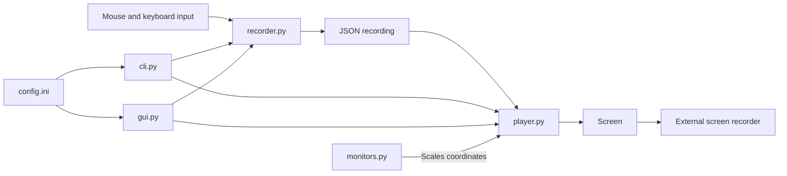

# ClickReplay

Record mouse and keyboard actions to editable JSON, then replay them for repeatable screen demos.

**ClickReplay does not record video.** Use a screen recorder such as OBS alongside it.

[](#install)
[](https://www.python.org/downloads/)
[](LICENSE)

## Overview

ClickReplay was made to record clean, repeatable takes for a tutorial video series.
It records input with pynput and replays it with eased mouse motion through pyautogui, using a CLI or Tkinter GUI.
Version 0.1.1, beta. Windows only, Python 3.12+.

## Architecture



- [recorder.py](src/clickreplay/recorder.py) writes hand-editable JSON; [player.py](src/clickreplay/player.py) replays it.
- [cli.py](src/clickreplay/cli.py) and [gui.py](src/clickreplay/gui.py) share `config.ini` settings; see [config.example.ini](config.example.ini).
- [monitors.py](src/clickreplay/monitors.py) scales coordinates for the replay display.

## Install

Download the Windows executable from [Releases](https://github.com/TelesforoAleix/ClickReplay/releases) and double-click it:

- x64: `ClickReplay-0.1.1-win-x64.exe`
- ARM64: `ClickReplay-0.1.1-win-arm64.exe`

Unsigned builds may be flagged by antivirus on first run.

Or install with Python 3.12+ from the project folder:

```powershell
python -m venv .venv
.\.venv\Scripts\Activate.ps1
pip install -e .
clickreplay --help
```

## Quick start

```powershell
# List monitors and their numbers
clickreplay monitors

# Record on monitor 0; press F9 to stop
clickreplay record --monitor 0 -o output/my-demo.json

# Start your screen recorder, then replay
clickreplay play output/my-demo.json

# Preview without moving the mouse
clickreplay play output/my-demo.json --dry-run
```

Change replay speed with `--speed` (e.g. `--speed 1.5`). Without `-o`, recordings are saved with a timestamped name.

## GUI

1. Launch `clickreplay-gui` or double-click the downloaded executable, then pick a monitor.
2. Click **Record**, wait for the countdown, and perform your steps.
3. Press **F9** or click **Stop** to save the recording as timestamped JSON.
4. Pick a recording from the **Recording** dropdown and click **Play**.

See [Usage reference](docs/usage.md) for configuration, point-stop pauses, hotkeys, commands, executable builds, and troubleshooting.

## Contributing

Install test dependencies with `pip install -e ".[dev]"`, then run `pytest`.
Keep tests headless and update documentation when user-facing behaviour or commands change.
[AGENTS.md](AGENTS.md) documents the architecture, invariants, and extension points.

## Licence

Released under the [MIT License](LICENSE).
